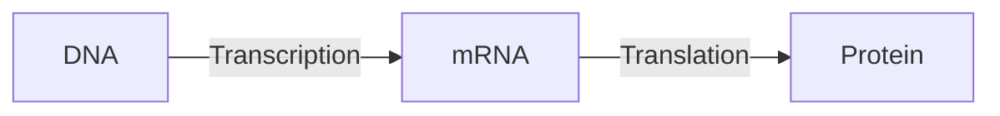

## Introduction to genetics

1. Deoxyribonucleic Acid (DNA) is a molecule composed of two strands twisted around each other to form a double helix. Each strand comprises nucleotides composed of a sugar (deoxyribose), a phosphate group, and a nitrogenous base. The nitrogenous bases in DNA are adenine (A), guanine (G), and cytosine (C), and they pair up with each other in a specific way: A pairs with T (thymine), and C pairs with G. This base pairing is what gives DNA its structure and allows it to store genetic information. Ribonucleic Acid (RNA), on the other hand, is similar to DNA in structure, but it contains a different type of sugar (ribose) and a different base, uracil (U), which pairs with adenine). Furthermore, RNA is usually single-stranded. A gene is a DNA segment containing the instructions for making a specific protein. A genome, on the other hand, refers to the complete set of genes within an organism, which is usually contained within its DNA.

2. Gene expression is the process by which the instructions in our DNA are converted into a functional product, such as a protein. This process involves two key steps: transcription and translation. Transcription is the process by which a specific segment of DNA, known as a gene, is copied into a messenger RNA molecule (mRNA). Once the mRNA molecule has been synthesised, it is transported out of the cell nucleus and into the cytoplasm. Here, it undergoes a process called translation, where each codon (a sequence of three bases) in the mRNA molecule is translated into a specific amino acid. These amino acids are then linked together in a specific order to form a protein.

3. Genes are organised in the DNA into operons or groups with similar promoters in the same way files are organised into folders
4. There are 64 possible codons, but only 20 code for amino acids, with the remaining codons serving as stop signals. The redundancy in the genetic code, where multiple codons can specify the same amino acid, provides robustness to mutations. This redundancy likely evolved to minimise the impact of genetic changes on protein function, offering adaptability and stability to living organisms.

## Sequence Alignment

1. The dynamic programming algorithm used for computing global alignment between 2 DNA sequences is known as the Needleman-Wunsch algorithm. 