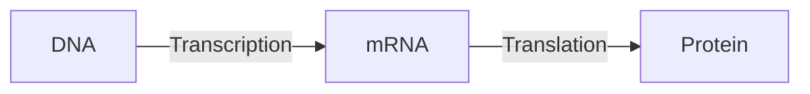

## Introduction to genetics

1. Deoxyribonucleic Acid (DNA) is a molecule composed of two strands twisted around each other to form a double helix. Each strand comprises nucleotides composed of a sugar (deoxyribose), a phosphate group, and a nitrogenous base. The nitrogenous bases in DNA are adenine (A), guanine (G), and cytosine (C), and they pair up with each other in a specific way: A pairs with T (thymine), and C pairs with G. This base pairing is what gives DNA its structure and allows it to store genetic information. Ribonucleic Acid (RNA), on the other hand, is similar to DNA in structure, but it contains a different type of sugar (ribose) and a different base, uracil (U), which pairs with adenine). Furthermore, RNA is usually single-stranded. A gene is a DNA segment containing the instructions for making a specific protein. A genome, on the other hand, refers to the complete set of genes within an organism, which is usually contained within its DNA.

2. Gene expression is the process by which the instructions in our DNA are converted into a functional product, such as a protein. This process involves two key steps: transcription and translation. Transcription is the process by which a specific segment of DNA, known as a gene, is copied into a messenger RNA molecule (mRNA). Once the mRNA molecule has been synthesised, it is transported out of the cell nucleus and into the cytoplasm. Here, it undergoes a process called translation, where each codon (a sequence of three bases) in the mRNA molecule is translated into a specific amino acid. These amino acids are then linked together in a specific order to form a protein.


3. Genes are organised in the DNA into operons or groups with similar promoters in the same way files are organised into folders
4. There are 64 possible codons, but only 20 code for amino acids, with the remaining codons serving as stop signals. The redundancy in the genetic code, where multiple codons can specify the same amino acid, provides robustness to mutations. This redundancy likely evolved to minimise the impact of genetic changes on protein function, offering adaptability and stability to living organisms.

## Sequence Alignment

1. The dynamic programming algorithm used for computing global alignment between 2 DNA sequences is known as the Needleman-Wunsch algorithm. Given two sequences $X$ and $Y$ and a scoring system, the algorithm constructs a matrix $M$ where each cell $M_{i,j}$ represents the optimal alignment score up to position $(i, j)$. Initialisation and matrix filling are based on a recurrence relation considering match/mismatch scores and gap penalties. Backtracking from the bottom right provides the optimal alignment. The score matrix $M$ is crucial, containing optimal alignment scores for each position. To convert this problem to the Longest Common Subsequence (LCS) problem, set the match score to 1, the mismatch score to 0, and the gap penalty to 0. The alignment score then equals the length of the LCS. Time complexity is $O(m \times n)$, with $m$ and $n$ as sequence lengths.
2. 
```python
def needleman_wunsch(s1, s2, match, mismatch, gap):
    m, n = len(s1), len(s2)
    dp = [[0 for _ in range(n + 1)] for _ in range(m + 1)]

    for i in range(m + 1):
        dp[i][0] = i * gap
    for j in range(n + 1):
        dp[0][j] = j * gap

    for i in range(1, m + 1):
        for j in range(1, n + 1):
            match_score = dp[i - 1][j - 1] + (
                match if s1[i - 1] == s2[j - 1] else mismatch
            )
            delete_score = dp[i - 1][j] + gap
            insert_score = dp[i][j - 1] + gap
            dp[i][j] = max(match_score, delete_score, insert_score)

    alignment1 = ""
    alignment2 = ""
    i, j = m, n
    while i > 0 and j > 0:
        if s1[i - 1] == s2[j - 1]:
            alignment1 += s1[i - 1]
            alignment2 += s2[j - 1]
            i -= 1
            j -= 1
        elif dp[i - 1][j] > dp[i][j - 1]:
            alignment1 += s1[i - 1]
            alignment2 += "-"
            i -= 1
        else:
            alignment1 += "-"
            alignment2 += s2[j - 1]
            j -= 1

    while i > 0:
        alignment1 += s1[i - 1]
        alignment2 += "-"
        i -= 1
    while j > 0:
        alignment1 += "-"
        alignment2 += s2[j - 1]
        j -= 1

    return dp[m][n],alignment1[::-1], alignment2[::-1]  
```

(-3, 'CG---TGAA-', '-GACTT--AC')

3. Key transformations are implemented to adapt the Needleman-Wunsch algorithm for optimal local alignments and incorporate affine gap penalties. The algorithm's initialisation is adjusted to allow local alignments by setting the first row and column of the matrix $M$ to 0 to permit local alignments to commence anywhere in the sequences. The recurrence relation is adjusted so that $M_{i,j} \geq 0$  and it considers both match/mismatch scores and affine gap penalties. A matrix $G$ is introduced to handle affine gap penalties. The recurrence relation of G is $$G(i,j) \gets \max\left\{\begin{array}{l}F(i-1, j)-d\\F(i, j-1)-d\\G(i, j)-e\\G(i-1, j)-e\\\end{array}\right.$$The algorithm now traces back from the cell with the maximum score until reaching a cell with a score of 0 to identify the optimal local alignment. These modifications enhance the algorithm's ability to find biologically meaningful local similarities in sequences. While the time complexity is affected due to the introduction of affine gap penalties, it remains $O(m \times n)$, maintaining efficiency in sequence alignment tasks.

4. The storage complexity of the global